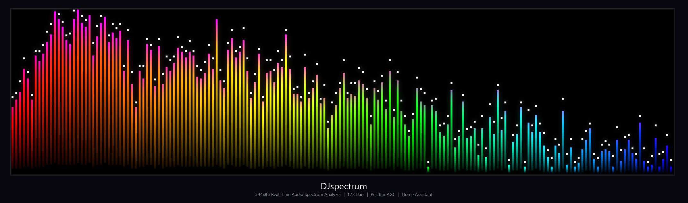
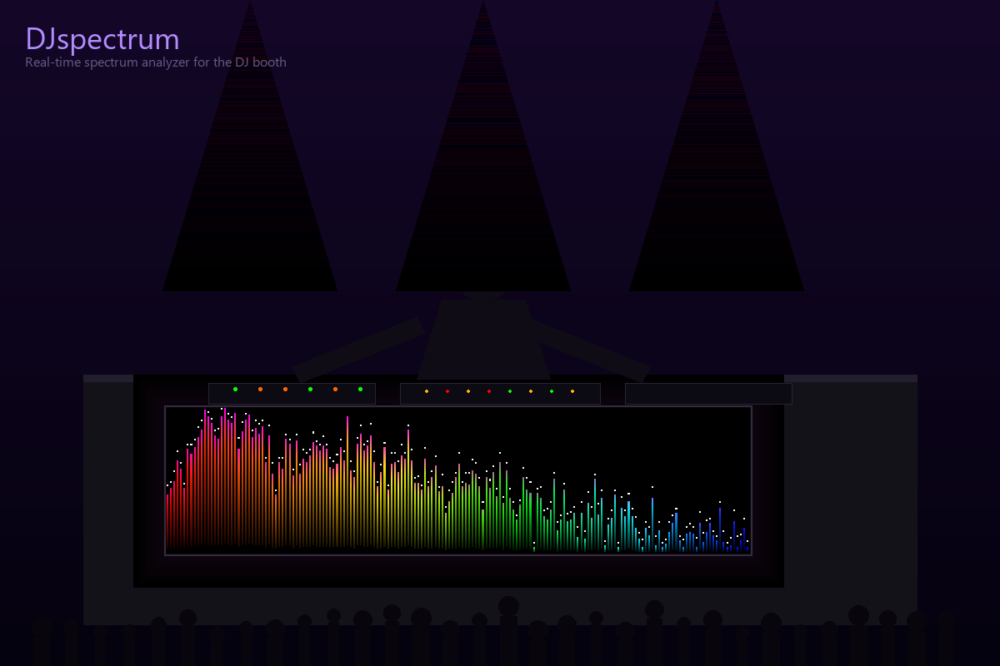
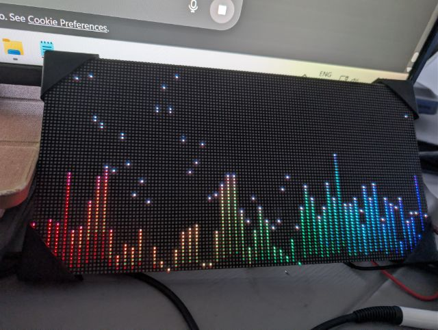
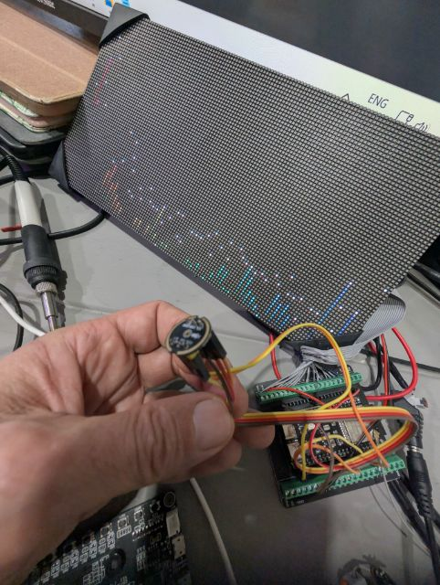
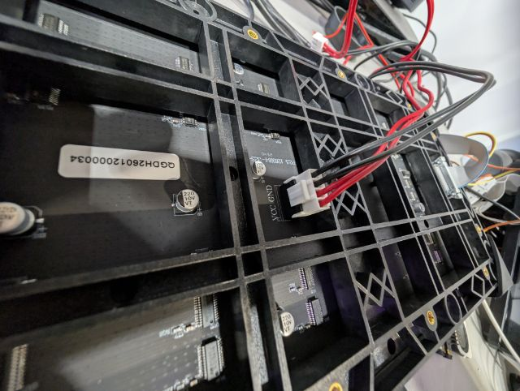
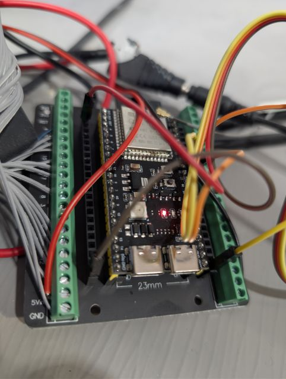
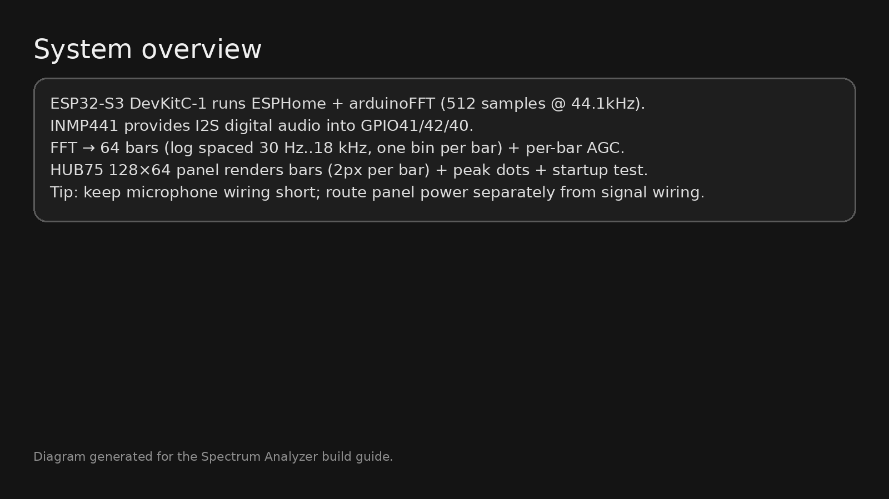
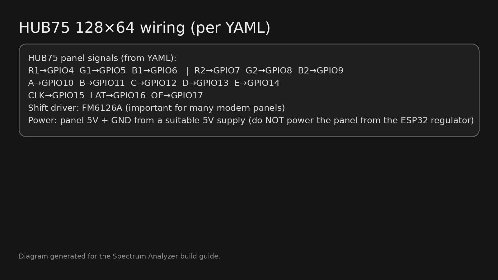

<p align="center">
  
</p>

<h1 align="center">DJspectrum</h1>
<p align="center">
  <strong>Real-time audio spectrum analyzer on commercial LED panels</strong><br>
  <em>Raspberry Pi + Colorlight 5A-75B + P1.86 LED Panels + Home Assistant</em>
</p>

<p align="center">
  <a href="#quick-start"></a>
  <a href="docs/02-BILL-OF-MATERIALS.md"></a>
  <a href="#license"></a>
  <a href="https://github.com/gbroeckling/DJspectrum/issues"></a>
</p>

---

## What is this?

DJspectrum turns two inexpensive P1.86 LED panels into a **344x86 pixel real-time audio spectrum analyzer** -- the kind you see behind DJs and in pro studios, but built from off-the-shelf parts for ~$250 CAD.

It's a faithful port of a [working ESP32-S3 spectrum analyzer](https://github.com/gbroeckling/Spectrum) onto much more capable hardware: a Raspberry Pi driving panels through a Colorlight 5A-75B receiving card over raw Gigabit Ethernet. The result is **172 frequency bars** (vs. the ESP32's 64), a **stunning 6-stop color gradient**, per-bar automatic gain control, and full Home Assistant integration via MQTT.

### The Spectrum Visualizer

```
    Red ─── Orange ─── Yellow ─── Green ─── Cyan ─── Blue
     ▲                                                 ▲
     │                                                 │
   30 Hz                                           18 kHz

    ┌──────────────────── 344px ────────────────────┐
    │  ▪                 ▪    ▪                     │ ← White peak dots
    │ ██   ▪            ██   ██  ▪                  │   with gravity decay
    │ ██  ██      ▪     ██   ██ ██                  │
    │ ██  ██  ██  ██    ██   ██ ██  ██              │ ← Purple shift at
    │ ██  ██  ██  ██    ██   ██ ██  ██  ██          │   bar tops
    │ ██  ██  ██  ██ ██ ██   ██ ██  ██  ██  ██     │
    │ ██  ██  ██  ██ ██ ██   ██ ██  ██  ██  ██  ██ │ ← Bottom fade
    │░██░░██░░██░░██░██░██░░░██░██░░██░░██░░██░░██░│   (dim → bright)
    └──────────────────── 86px tall ────────────────┘
         172 bars × 2px each, 1px gap between bars
```

**Per-bar AGC** with a 4-minute time constant means the display auto-adapts to any volume level -- whispered conversation or full-blast concert -- without clipping or going dark.

---

## The Vision

<p align="center">
  
</p>
<p align="center"><em>Concept: DJspectrum panel mounted on the front of a DJ booth, reacting to the music in real-time</em></p>

## Gallery

### Prototype Hardware (ESP32-S3, 64 bars on 128x64)

| Running | Build | Hardware |
|:---:|:---:|:---:|
|  |  |  |
| *Live spectrum output* | *Front panel + INMP441 mic* | *Rear wiring and power* |

### Diagrams

| Controller | System Overview | HUB75 Wiring |
|:---:|:---:|:---:|
|  |  |  |
| *Colorlight 5A-75B closeup* | *Full system architecture* | *HUB75 daisy-chain diagram* |

> **Note:** Photos show the ESP32-S3 prototype (64 bars on 128x64). The Raspberry Pi version drives **172 bars on 344x86** -- same visual style at more than double the resolution.

---

## Hardware

| Component | Spec | Purpose |
|---|---|---|
| **Raspberry Pi 4/5** | 4GB+ RAM, Gigabit Ethernet | Runs Python, sends pixel data |
| **Colorlight 5A-75B** (V8) | 16x HUB75 ports, Gigabit input | Drives panels at any scan rate |
| **2x P1.86 LED Panel** | 172x86px, 320x160mm, 1/43 scan | Display surface (side-by-side = 344x86) |
| **5V 20A PSU** | Mean Well or equivalent | Powers panels (~30W typical, 60W peak) |
| **USB Microphone** | Any USB mic / sound card | Audio input for spectrum analysis |
| **Cat6 Ethernet** | Gigabit link required | Pi to Colorlight data path |

**Total resolution:** `344 x 86` pixels (horizontal layout)
**Total cost:** ~$250 CAD -- see [full BOM](docs/02-BILL-OF-MATERIALS.md)

### Wiring Overview

```
                    ┌─────────────────────────────────────────────┐
                    │              5V 20A PSU                      │
                    │   AC ─────────────────────────> DC 5V        │
                    └───┬─────────────┬─────────────┬─────────────┘
                        │ 5V          │ 5V          │ 5V
                        ▼             ▼             ▼
┌──────────┐     ┌─────────────┐  ┌────────┐  ┌────────┐
│ RPi 4/5  │────>│  Colorlight │─>│ Panel 1│─>│ Panel 2│
│          │ GbE │  5A-75B     │  │ 172x86 │  │ 172x86 │
│ USB Mic  │     │  (J1 port)  │  │ P1.86  │  │ P1.86  │
└──────────┘     └─────────────┘  └────────┘  └────────┘
                   Cat6 cable      HUB75 flat    HUB75 flat
                                   ribbon        ribbon
```

---

## Software Architecture

```
  USB Microphone
       │
       ▼
┌─────────────────┐     ┌──────────────┐     ┌─────────────────┐
│  spectrum.py    │────>│  renderer.py │────>│  colorlight.py  │──> Ethernet ──> Panels
│  PyAudio + FFT  │     │  Pillow RGB  │     │  Raw L2 frames  │
│  Per-bar AGC    │     │  344x86 buf  │     │  ethertype 5500 │
└─────────────────┘     └──────────────┘     └─────────────────┘
                               ▲
                               │
                        ┌──────────────┐     ┌─────────────────┐
                        │   main.py    │◄───│  mqtt_bridge.py │◄── Home Assistant
                        │  Render loop │     │  HA discovery   │        (MQTT)
                        │  30 FPS      │     │  Commands/state │
                        └──────────────┘     └─────────────────┘
```

| File | Description |
|---|---|
| [`spectrum.py`](spectrum.py) | Audio capture + FFT + per-bar AGC engine (ported from ESP32) |
| [`renderer.py`](renderer.py) | Pillow-based pixel renderer (spectrum, text, clock, sensors, alerts) |
| [`colorlight.py`](colorlight.py) | Raw Ethernet protocol driver for Colorlight 5A-75B |
| [`mqtt_bridge.py`](mqtt_bridge.py) | MQTT client with Home Assistant auto-discovery |
| [`main.py`](main.py) | Application shell: render loop, mode switching, lifecycle |
| [`config.yaml`](config.yaml) | All settings (display, network, MQTT, audio, modes) |
| [`install.sh`](install.sh) | One-command Raspberry Pi installer with systemd service |

---

## The Algorithm

The spectrum engine is a faithful Python port of the ESP32 C++ code from [gbroeckling/Spectrum](https://github.com/gbroeckling/Spectrum). Here's what makes it special:

### Per-Bar Automatic Gain Control

Most spectrum analyzers either clip on loud music or go dark in quiet rooms. DJspectrum uses **independent slow AGC per frequency bar** with a 4-minute time constant:

```
Audio → FFT → Log magnitude → Balance tilt → Noise subtraction
  → Per-bar slow AGC (tau=240s) → 20s/10min max normalization
  → Output stretch/gamma shaping → Bar height → Smooth attack/release
  → Peak hold with gravity decay
```

| Parameter | Value | Purpose |
|---|---|---|
| `BAR_AVG_TAU` | 240s (4 min) | Slow gain adaptation -- no pumping |
| `GAIN_TIE_MAX_RATIO` | 2.5 | Prevents any bar from being >2.5x others |
| `NOISE_MULT` | 1.12 | Noise floor subtracted before AGC |
| `OUT_STRETCH` | 1.12 | Expands dynamic range |
| `OUT_GAMMA` | 0.85 | Perceptual brightness correction |
| `PEAK_DECAY_INTERVAL` | 240ms | Gravity-style peak dot falloff |

### Frequency Mapping

Log-spaced bins from **30 Hz to 18 kHz**, one FFT bin per bar. With 172 bars on a 344px display (2px per bar + 1px gap), every audible frequency gets its own column.

### Visual Style

- **6-stop gradient**: Red (bass) -> Orange -> Yellow -> Green -> Cyan -> Blue (treble)
- **Bottom fade**: Bars brighten from dim at the base to full intensity
- **Purple shift**: Bar tops shift toward purple on tall bars
- **White peak dots**: Gravity-decay peak indicators above each bar
- **Boot animation**: Sinusoidal wave pattern for 6 seconds on startup

---

## Quick Start

### Prerequisites

- Raspberry Pi 4 or 5 (Raspberry Pi OS)
- Colorlight 5A-75B configured via LEDVision ([setup guide](docs/04-COLORLIGHT-LEDVISION-SETUP.md))
- Two P1.86 panels wired and powered ([assembly guide](docs/03-ASSEMBLY-GUIDE.md))
- USB microphone or sound card
- MQTT broker (optional, for Home Assistant control)

### 1. One-time Colorlight Setup (Windows PC)

Connect the 5A-75B to a Windows PC via Gigabit Ethernet and configure with LEDVision:

| Setting | Value |
|---|---|
| Module width | 172 |
| Module height | 86 |
| Scan mode | 1/43 |
| Driver IC | ICN2038S |
| Port | J1 |
| Panel chain | 2 |

Save to receiver flash. Full guide: [04-COLORLIGHT-LEDVISION-SETUP.md](docs/04-COLORLIGHT-LEDVISION-SETUP.md)

### 2. Deploy to Raspberry Pi

```bash
# Copy files to Pi
scp -r DJspectrum/ pi@<your-pi-ip>:~/DJspectrum

# SSH in
ssh pi@<your-pi-ip>

# Edit config (set your MQTT broker IP, credentials)
nano ~/DJspectrum/config.yaml

# Install everything
cd ~/DJspectrum && sudo bash install.sh

# Start the service
sudo systemctl start ledpanel
```

### 3. Test

```bash
# Test pattern (no audio needed)
sudo /opt/ledpanel/venv/bin/python3 /opt/ledpanel/main.py --test

# List audio devices
/opt/ledpanel/venv/bin/python3 /opt/ledpanel/spectrum.py

# Run with debug logging
sudo /opt/ledpanel/venv/bin/python3 /opt/ledpanel/main.py --debug
```

### 4. Service Management

```bash
sudo systemctl start ledpanel     # Start
sudo systemctl stop ledpanel      # Stop
sudo systemctl restart ledpanel   # Restart
sudo systemctl status ledpanel    # Status
journalctl -u ledpanel -f         # Live logs
```

---

## Display Modes

DJspectrum supports multiple display modes, switchable via MQTT from Home Assistant:

| Mode | Description | Example Command |
|---|---|---|
| `spectrum` | **Real-time audio spectrum analyzer** | `{"mode": "spectrum"}` |
| `clock` | Live clock with optional date | `{"mode": "clock", "show_date": true}` |
| `text` | Static text with color/size/alignment | `{"mode": "text", "text": "Hello!", "color": "#00FF00"}` |
| `scroll` | Horizontally scrolling text | `{"mode": "scroll", "text": "Breaking news...", "speed": 2}` |
| `sensors` | Dashboard grid of HA sensor values | `{"mode": "sensors", "data": {"Temp": "22C"}}` |
| `alert` | Flashing border alert message | `{"mode": "alert", "text": "DOOR OPEN!"}` |
| `multiline` | Multiple lines, auto-centered | `{"mode": "multiline", "lines": ["Line 1", "Line 2"]}` |
| `image` | Display an image file | `{"mode": "image", "path": "/tmp/img.png"}` |
| `progress` | Progress bar with label | `{"mode": "progress", "label": "CPU", "value": 73}` |
| `off` | Display off (black) | `{"mode": "off"}` |

### MQTT Topics

| Topic | Direction | Purpose |
|---|---|---|
| `ledpanel/command` | HA -> Panel | JSON mode commands |
| `ledpanel/brightness/set` | HA -> Panel | Brightness 0-255 |
| `ledpanel/state` | Panel -> HA | Current state feedback |
| `ledpanel/available` | Panel -> HA | online/offline status |

### Home Assistant Auto-Discovery

The panel automatically registers these entities:

- `light.led_panel` -- on/off + brightness slider
- `sensor.led_panel_mode` -- current display mode
- `number.led_panel_brightness` -- brightness control

See [`ha_config/automations.yaml`](ha_config/automations.yaml) for 9 ready-to-use automation examples.

---

## Documentation

| Guide | Contents |
|---|---|
| [Wiring Diagrams](docs/01-WIRING-DIAGRAMS.md) | System layout, PSU wiring, HUB75 daisy chain, pinouts |
| [Bill of Materials](docs/02-BILL-OF-MATERIALS.md) | Complete BOM with prices (~$250 CAD) |
| [Assembly Guide](docs/03-ASSEMBLY-GUIDE.md) | 8-phase step-by-step build instructions |
| [Colorlight Setup](docs/04-COLORLIGHT-LEDVISION-SETUP.md) | One-time Windows LEDVision configuration |
| [Network & Pi Setup](docs/05-NETWORK-AND-PI-SETUP.md) | Pi OS, networking options, MQTT setup |
| [Power Calculations](docs/06-POWER-CALCULATIONS.md) | 59.4W max, PSU sizing, safety |
| [Troubleshooting](docs/07-TROUBLESHOOTING.md) | Diagnostic flowcharts for hardware/software/network |

---

## Origins: ESP32 to Raspberry Pi

This project is the next generation of [gbroeckling/Spectrum](https://github.com/gbroeckling/Spectrum) -- an ESP32-S3-based spectrum analyzer with an INMP441 I2S microphone and a single 128x64 HUB75 panel.

| | ESP32-S3 (v1) | Raspberry Pi (v2 -- this repo) |
|---|---|---|
| **Processor** | ESP32-S3 @ 240 MHz | RPi 4/5 @ 1.5+ GHz |
| **Display** | 128x64 HUB75 (direct drive) | 344x86 via Colorlight 5A-75B |
| **Bars** | 64 | 172 |
| **Audio** | INMP441 I2S mic | USB mic / sound card |
| **HA Integration** | ESPHome native API | MQTT with auto-discovery |
| **Firmware** | C++ / ESPHome | Python |
| **Cost** | ~$40 | ~$250 |

The core algorithm (per-bar AGC, noise tracking, gain tying, output shaping) is identical -- just ported from C++ to Python with numpy.

---

## Contributing

This is an active project and contributions are very welcome! Here are some areas where help would be great:

- **GPU-accelerated rendering** -- move spectrum rendering to OpenGL/Vulkan for lower CPU usage
- **Web dashboard** -- a browser UI for mode switching and configuration
- **More visualizations** -- VU meters, waveforms, frequency waterfall, beat detection
- **Multi-panel layouts** -- support for 3+ panels in arbitrary arrangements
- **Audio input options** -- PulseAudio, JACK, Bluetooth A2DP capture
- **Colorlight protocol reverse engineering** -- better understanding of the 5A-75B packet format
- **Mobile app** -- companion app for quick mode/brightness control

If you build one, please share a photo or video!

---

## License

[MIT](LICENSE) -- use it, fork it, build something awesome.

---

<p align="center">
  <strong>Built with Python, raw Ethernet packets, and an unreasonable love for blinking LEDs.</strong>
</p>
